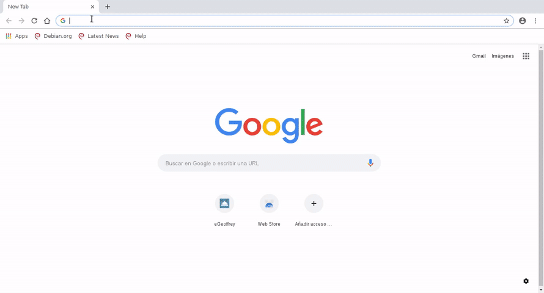

# Hi eGeoffrey, please come on in
Even though eGeoffrey is going to make a lot of things for you, you need to setup its accommodation; it'll take a while, and the effort you have to make will depend upon the services you want eGeoffrey to offer you, but the process is as easy as:

1. **Open a door** to enter eGeoffrey's accommodation; the steps to open a door, commonly called open ***remote access***, to enter eGeoffrey's accommodation (aka *Raspberry/Orange Pi*) are described at [SSH (Secure Shell)](https://www.raspberrypi.org/documentation/remote-access/ssh/).

2. Bring **furnitures and groceries** eGeoffrey likes the most to its new accommodation. Don't worry, these furnitures and groceries are just *bits and bytes that you can get remotely for free*; remember that eGeoffrey is an electronic butler and it likes this kind of things.

    In order to bring all this stuff together, **go into the eGeoffrey's accommodation securely** (SSH connection to cross that door) and **tell the magic words** (you better copy and paste the following line :) ):

```
    sudo bash -c "$(curl -ssL https://get.egeoffrey.com)"
```

3. **Let the workers do the setup**, but tell them one thing or two to leave the accommodation the way you like for eGeoffrey. They will ask you the following:

    - **Where do you want to install eGeoffrey?**, meaning where to leave all those furnitures and groceries for eGeoffrey; ```/opt/egeoffrey``` can be a nice place.

    The following video shows you how the workers, also called *installer*, do their job and the questions they will ask you:

    

Once the installation is finished, it could take a while before eGeoffrey fully comes to life. 
Run the following to ensure every component is reported in a status of "Up" before connecting to the web interface:
```
sudo egeoffrey-cli house status
```

Once the workers are done, eGeoffrey is ready to enjoy its new accommodation:



You can now access the web interface and finalize the installation.