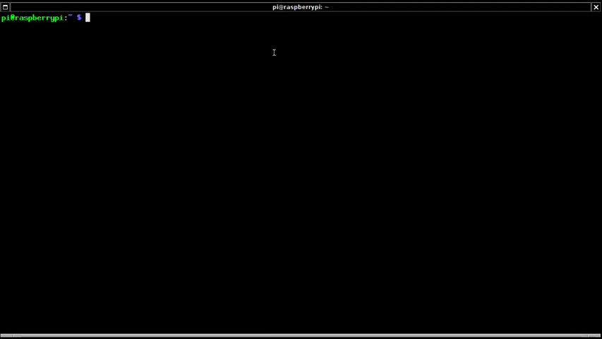

# Say hi to him
*'Sir, madam, in this section I'll tell you everything you need to know to take advantage of my services as soon as possible'*. First choice you have to make is where eGeoffrey is going to live; it can live in the cloud or in your house, follow the appropriate section according to your needs.

Even though this guide will try to be as simple as possible, some technical terms will be used. If you don't find those terms familiar, feel free to stop by our community and ask others; eGeoffrey's community is one of the most friendly communities out there, as we all are into butler education and standards.

## Where will eGeoffrey stay?

### eGeoffrey in your house
Yes, eGeoffrey can be with you at home but, good news!, you don't have to get an extra room for it because it likes to live in computers; at the end of the day, eGeoffrey is an electronic butler, therefore it leaves inside a computer. You will know eGeoffrey better over time, and will realize it is not very showy but humble most of the time, so it will manage to live in a small and cheap computer such as a Raspberry/Orange Pi.

#### Raspberry/Orange Pi
Buying a computer might be a tough task if you're not an expert but, as we've said many times, eGeoffrey is here to make your life easier and not to make it more difficult. The easiest and most convenient way to let eGeoffrey be with you in your house is by purchasing a mini personal computer such as a [Raspberry Pi](https://en.wikipedia.org/wiki/Raspberry_Pi) or [Orange Pi](http://www.orangepi.org/), running the default [Raspbian operating system](https://www.raspbian.org/). Both options are cheap; they're worth less than 100$/€, are small and they consume very little power, which makes them ideal to have eGeoffrey on duty all the time. However, that means eGeoffrey will never sleep so, don't complain if you find eGeoffrey lazier than usual at some point :)

#### Other options
Are you an experimented computer user? You might want to evaluate some other options. eGeoffrey runs on arm and x64 processors based computers, [compatible with Docker](https://docs.docker.com/engine/faq/) and running a Linux operating system.

**This section will asume you're accommodating eGeoffrey on a Raspberry/Orange Pi mini personal computer running Raspbian as the operationg system.** The steps presented here should be enough for advanced users who want to try it in a different computer; however, if you're exploring this path and face some issues, ask for help in our community.

### eGeoffrey in the Cloud
Unfortunately, eGeoffrey has developed fear of heights and is under medical treatment; for this reason, he's not going to live in the Cloud for a while. As soon as he is rehab, eGeoffrey will let you know... he is very sorry for the inconveniences caused.

## Hi eGeoffrey, please come on in
Even though eGeoffrey is going to make a lot of things for you, you need to setup its accommodation; it'll take a while, and the effort you have to make will depend upon the services you want eGeoffrey to offer you, but the process is as easy as:

1. **Open a door** to enter eGeoffrey's accommodation; the steps to open a door, commonly called open ***remote access***, to enter eGeoffrey's accommodation (aka *Raspberry/Orange Pi*) are described at [SSH (Secure Shell)](https://www.raspberrypi.org/documentation/remote-access/ssh/).

2. Bring **furnitures and groceries** eGeoffrey likes the most to its new accomodation. Don't worry, these furnitures and grocesies are just *bits and bytes that you can get remotely for free*; remember that eGeoffrey is an electronic butler and it likes this kind of things.

    In order to bring all this stuff together, **go into the eGeoffrey's accommodation securely** (SSH connection to cross that door) and **tell the magic words** (you better copy and paste the following line :) ):

    <sub>
    ```
    sudo bash -c "$(curl -ssL https://get.egeoffrey.com)"
    ```
    </sub>

3. **Let the workers do the setup**, but tell them one thing or two to leave the accommodation the way you like for eGeoffrey. They will ask you the following:

    - **Where do you want to install eGeoffrey?**, meaning where to leave all those furnitures and groceries for eGeoffrey; ```/opt/egeoffrey``` can be a nice place.
    - **What is, if any, the hostname of your remote gateway?**, it's all about the name of eGeoffrey's accommodation; hitting enter and leave it blank beacuse it's not relevant at this point.

    The following video shows you how the workers, also called *installer*, do their job and the questions they will ask you:


    

Once the workers are done, eGeoffrey is ready to enjoy its new accommodation:


### eGeoffrey’s GUI, what for?

eGeoffrey's GUI is one of the multiple ways to interact with eGeoffrey and setup its accomomodation; through the GUI, you'll be able to address the following:

* See messages from eGeoffrey classified by criticality: information, warnings or, if it's something serious, alerts.
* Display metrics, pictures from webcams, a to-do list, appointments, etcetera you've told eGeoffrey to deal with in advance.
* Text eGeoffrey throughout the chatbot window.
* Extend eGeoffrey's functionality by adding extensions to its new and empty accommodation.

The three main parts of the GUI are:

1. **Notification area.-** eGeoffrey reminds you what the name of your house is, date and time, messages classified by criticality and, finally, an item telling you how much data eGeoffrey is handling in real-time; you can disable it if you're not interested in that.
2. **Main menu.-** it's, in essence, the place where you will explore everything eGeoffrey has to offer. It's made of sections and items to organize all the content, which will depend upon who is accessing the GUI. 

    If the one accessing the GUI is not someone eGeoffrey trusts (*guest*), it won't display that much info:
    
    
    However, if the one accessing is the owner of the house (*admin*), eGeoffrey will display all the information and will allow to change its accommodation to, potentially, provide additional services:

    Remember that eGeoffrey has security and confidentiality in its DNA, and this is just an example of it.

3. **Content display.-** this is the main area where all the action will happen. In the content display you'll see the chatbot window to text eGeoffrey, metrics collected and prepared for you by eGeoffrey, pictures from webcams you previously told eGeoffrey to control, etcetera.

### Rolling up your sleeves, the CLI

Even though most of the time you'll interact with eGeoffrey by using your web browser or chatting via instant messaging, sometimes you'll have to ***"get your hands dirty"*** visiting eGeoffrey's accommodation and typing commands to add new skills among other tasks.

Fortunately, eGeoffrey's creators are thoughtful and created a utility called ```egeoffrey-cli``` to make things easier. This tool is available once you enter eGeoffrey's accommodation via [SSH (Secure Shell)](https://www.raspberrypi.org/documentation/remote-access/ssh/).

Once you're in, you might want to invoke the utility like this to get a list of all the options:

```
$ sudo egeoffrey-cli -d /opt/egeoffrey
```

where ```/opt/egeoffrey``` is the place where eGeoffrey's belongings are left; change it to suit your preferences if you chose a different place during the installation process:

